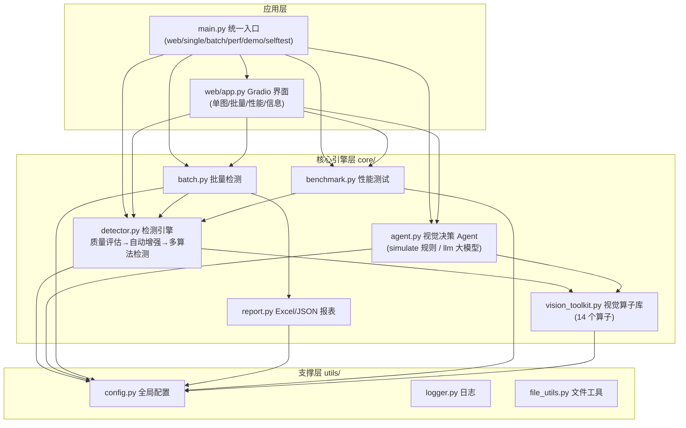
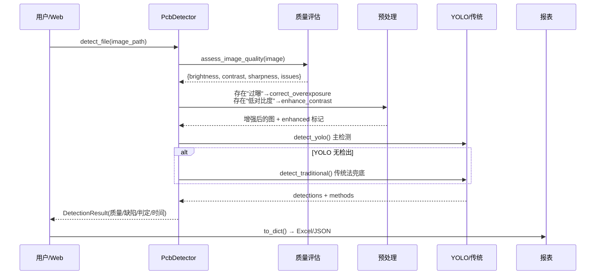
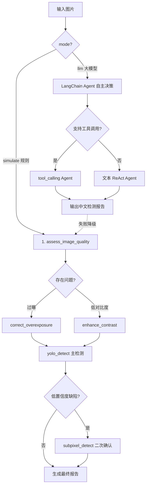

# 系统架构设计

## 1. 总体架构

本项目把整个学习过程（预处理 → 相机标定 → Halcon → YOLO 训练 → 视觉 Agent → Web/报表）整合为
**核心引擎层 + 决策智能层 + 应用层** 三层架构：

## 2. 模块职责

| 模块 | 职责 | 依赖 |
|---|---|---|
| `core/vision_toolkit.py` | 14 个视觉算子：质量评估 / CLAHE 增强 / 去噪 / 过曝校正 / Gamma / 阈值 / 形态学 / 轮廓 / YOLO 检测 / Halcon 亚像素 | cv2, numpy, ultralytics, halcon(可选) |
| `core/detector.py` | `PcbDetector` 高层引擎：质量评估 → 自动预处理 → YOLO/传统多算法检测 → 判定 | vision_toolkit |
| `core/agent.py` | `VisionAgent` 双模式 Agent；6 个 LangChain 工具；LLM(Ollama) 接入 | vision_toolkit, langchain |
| `core/report.py` | Excel 质检报表（带样式/良率）、JSON 日志/报表落盘 | openpyxl(可选) |
| `core/batch.py` | 文件夹批量检测 + 报表 + 异常图归档 | detector, report |
| `core/benchmark.py` | 推理速度 / 准确率 / 传统 vs YOLO 对比 | detector, report |
| `web/app.py` | Gradio 界面（单图/批量/性能/项目信息） | core 各模块 |
| `utils/config.py` | 全局路径/模型/参数，支持环境变量覆盖 | 无 |
| `utils/logger.py` | 控制台 + 文件双输出，UTF-8 修复 | config |
| `utils/file_utils.py` | 目录/时间戳/图片查找读写 | config |

## 3. 检测数据流

## 4. Agent 决策流（双模式）

## 5. 关键设计决策

1. **双模式 Agent**：`simulate` 无需 API 可离线演示；`llm` 连接本地 Ollama；
   模型不支持工具调用自动回退 ReAct；LLM 不可用自动降级 simulate。
2. **单例模型加载**：YOLO 模型模块级缓存（`_yolo_model`），避免重复加载耗时。
3. **规则引擎兜底**：`PcbDetector` 在 YOLO 无检出时用传统法兜底，比 Agent 单纯 YOLO 更灵敏。
4. **配置集中化**：路径/模型/参数全部收敛到 `utils/config.py`，环境变量可覆盖
   （`YOLO_WEIGHTS` / `VISION_AGENT_MODE` / `CONF_THRESHOLD` 等）。
5. **可选依赖优雅降级**：Halcon 缺失→OpenCV 替代；openpyxl 缺失→跳过报表；
   LangChain 缺失→占位基类保证模块可导入。
6. **绘制分流**：`annotate()` 根据检测结果是否含 `class_id` 自动选择
   YOLO 样式或传统轮廓样式（修复了 `KeyError: 'class_id'`）。
